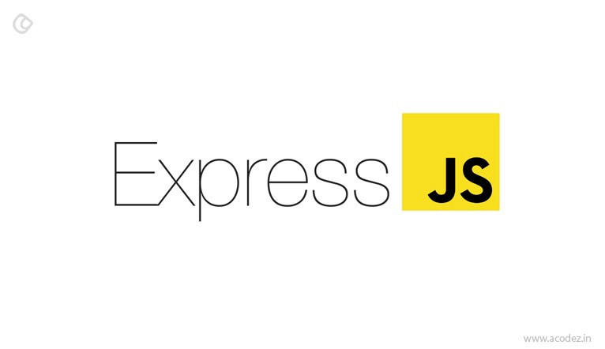

# Backend-Development
<h2>This repository contains all necessary files of my Backend Development</h2>
<!--START_SECTION:waka-->
    <h4>Technology stack</h4>
    <ul>
        <li>
            Node.js
        </li> 
        
        <li>
            MongoDB
        </li> 
        
        <li>
            Express.js
        </li> 
        
        <li>
            ApacheServer
        </li> 
        
    </ul>
<!--END_SECTION:waka-->
 
